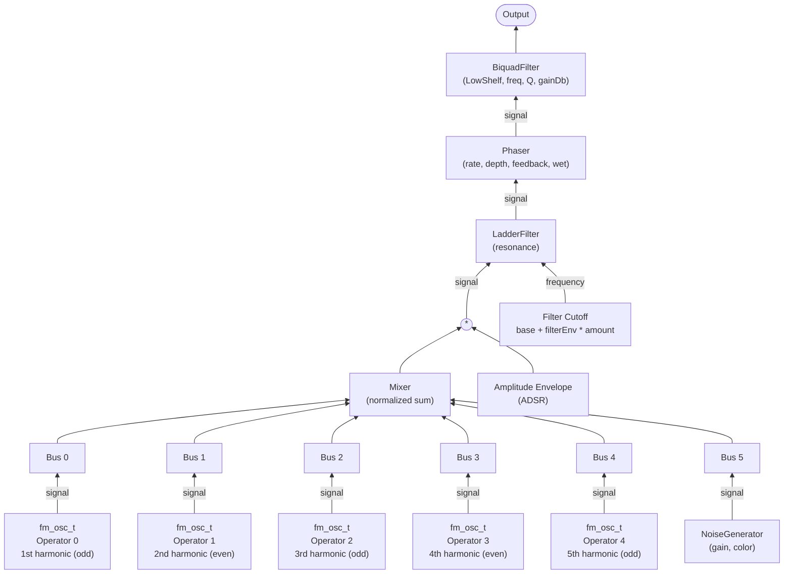
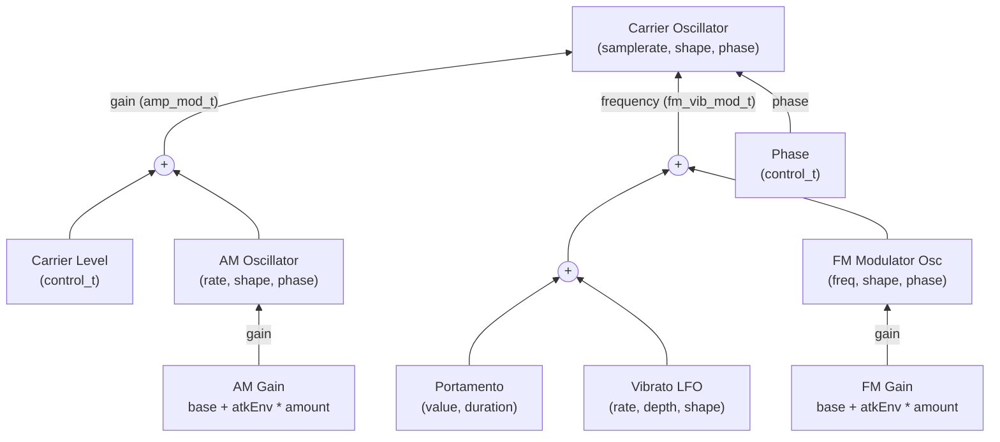
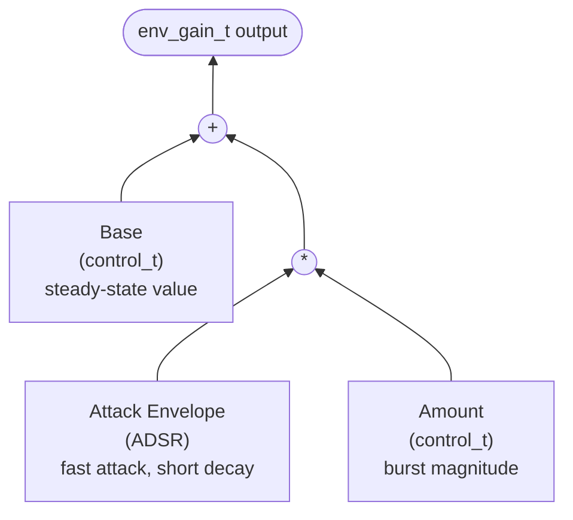
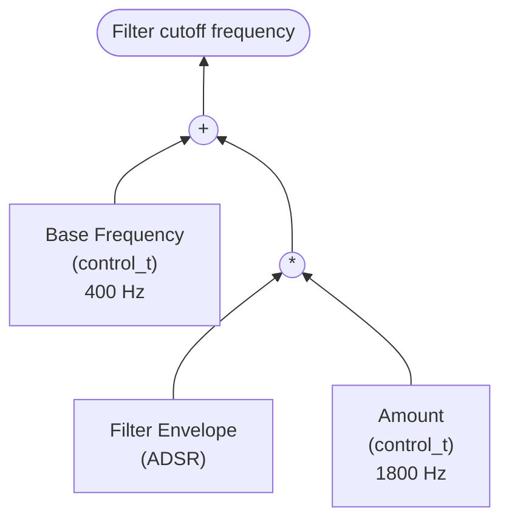

# Complex FM Synth — Audio Graph

The graph is a compile-time tree of DSP nodes, evaluated sample-by-sample via `operator()`.
All smoothed parameters use `FixedSmoother<float, 512>` for glitch-free changes.

## Top-level signal flow

## Per-operator structure (fm_osc_t)

Each of the 5 operators is an FM oscillator with amplitude modulation,
vibrato, and envelope-controlled FM/AM burst at note onset.

## Envelope-controlled gain (env_gain_t)

Used for both FM modulator gain and AM oscillator gain.
Provides a burst of extra modulation at note onset that decays via the attack envelope.

## Filter cutoff envelope (filter_env_freq_t)

Same structure as env_gain_t but controlling the LadderFilter cutoff frequency.

## Output EQ (biquad_t)

Final-stage BiquadFilter configured as a low shelf to tame low-end rumble.
Supports all standard biquad types (LPF, HPF, BPF, Notch, Peak, LowShelf, HighShelf)
via the `Type` enum. Uses `IIRFilter<float, 3>` (Direct Form II) internally.

Default settings: LowShelf at 200 Hz, Q = 0.707, -3 dB.

## Envelope gating

All envelopes are gated together via `Envelope::setGate()`:
- **Amplitude envelope** — slow attack (1.2s) for bowed character
- **Filter envelope** — controls LadderFilter cutoff sweep
- **Attack envelopes** — 5 FM + 5 AM, fast attack (0.01s) / short decay (0.15s) for bow onset transient
